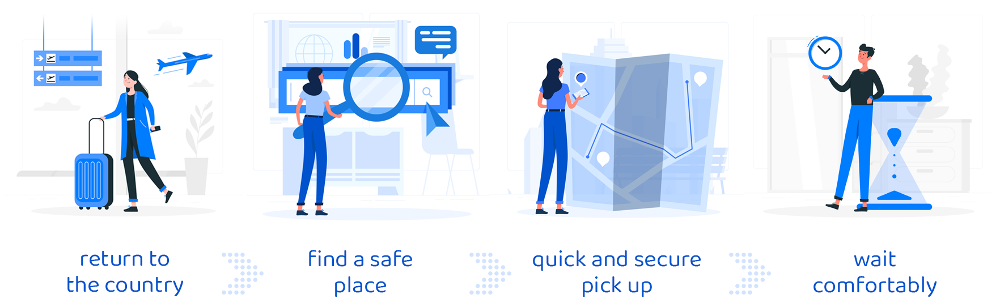
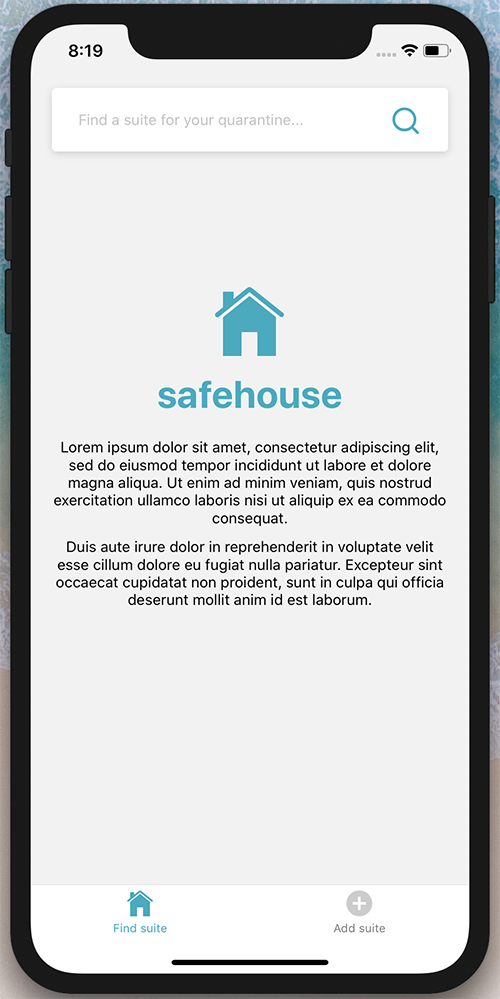

   

Project ceated for the hackathon [Hack the Crisis](https://www.hackcrisis.com/). Let's safe the world together 🚀

## Run the project
### Run localy on your computer
TODO
### Run on your device
1. Download Expo app on your device ([iOS](https://apps.apple.com/us/app/expo-client/id982107779) or [Android](https://play.google.com/store/apps/details?id=host.exp.exponent&hl=en_US)).
2. [Scan the code](https://expo.io/@graffme/safehouse) with Expo app to run safehouse application.
3. Enjoy the prototype.

## Safe place for quarantine 
   
In the daily report of the **Ministry of Health** on Twitter, a huge number of people returning to the country are reported to quarantine every day. Many people may not be able to spend it at home or want to avoid it because of potential infection of the family. Also, people who are currently in the country may have the same problem. For example - the doctor finds out that he/she has had contact with a sick person and does not want to spend his/her quarantine in the family home.

Hotels and apartments for rent are currently the most affected sector. It is worth convincing the owners to make their property available as safe quarantine facilities. In this way, two problems are solved:
* Overcrowding of public quarantine facilities.
* Big economic losses in the hotel and tourism sector.

This is a quick prototype of an application with a list of apartments. Additional amenities could include grocery shopping with non-contact delivery or a **special bus/car for pick up and transport to the apartment**. 

## Adding apartments to the list
Project is very simple and quick to implement as an application, but it would require:
* Cooperation of platforms like airbnb, booking.com and others.
* A group of people who will verify applications of suites (form private hosts).
* A list of requirements that would have to be met by such places and appropriate regulations on how to clean the apartments as guests leave them.

Larger platforms can be encouraged to add in their API whether the host agrees to provide the apartment for this purpose. The list in the safehouse application could then retrieve and display this information. For example, available APIs for larger platforms:
- Airbnb (link) https://www.airbnb.pl/partner
- Booking.com (link) https://developers.booking.com/api/index.html

For private hosts, an additional verification process will be needed:
1. The host reports a place via the form in the safehouse application. IMPORTANT. In the form, he must provide the website through which the place is booked and which contains contact to the owner! This contact will be used for verification.
2. An apartment is added to the database. However, it is not verified, so it will not appear on the list in the application yet.
3. A special group of people checks the apartment applications manually. They send the verification link for the host to the provided contact.
4. The host automatically clicking on the link causes the apartment to be verified and the suite appears on the list.

## Screenshots
  
  
  
  

## Graphic resources
[Beautiful illustrations made by @stories](https://www.freepik.com/stories) 
[App icon from Flaticon on Freepik](https://www.flaticon.com/free-icon/home-location_106423)
